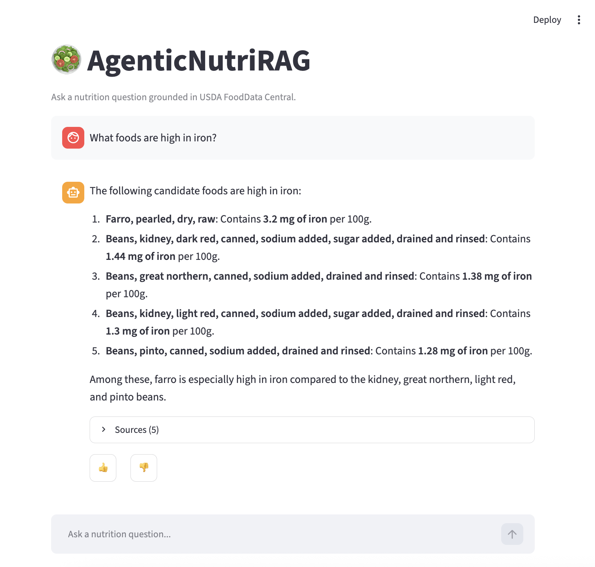
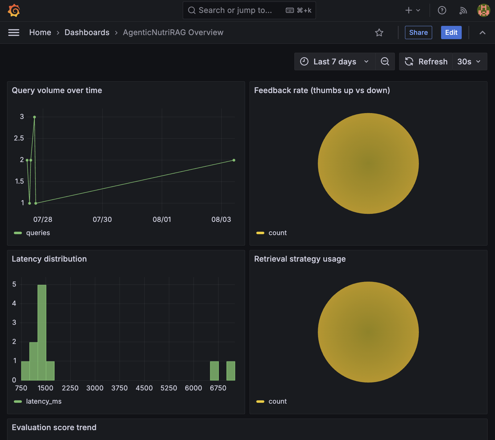

# AgenticNutriRAG

An agentic RAG system for nutrition questions, grounded in the USDA
FoodData Central dataset, with offline retrieval/answer evaluation and a
Postgres + Grafana monitoring stack. Built as the final project for the
[DataTalksClub LLM Zoomcamp](https://github.com/DataTalksClub/llm-zoomcamp).

## Problem Description

Nutrition facts are scattered across labels, apps, and inconsistent web
sources, and most people don't know how to query a structured nutrient
database directly. AgenticNutriRAG lets a user ask a plain-language
nutrition question ("what's a good low-calorie source of fiber?", "how much
iron is in an egg?") and get a grounded, source-cited answer backed by the
USDA's own lab-analyzed food data — not an LLM's unverified prior.

The system:
- retrieves candidate foods from Elasticsearch using hybrid (BM25 + vector)
  search over an LLM-rewritten version of the question,
- lets the model call a `lookup_food_nutrients` tool to pull full nutrient
  detail for any candidate,
- generates an answer that cites the specific USDA foods it used,
- logs every question/answer/feedback event to Postgres and visualizes it
  in Grafana,
- and is evaluated offline on both retrieval quality (hit rate, MRR) and
  answer quality (embedding similarity, LLM-as-judge) so the shipped
  configuration is a measured choice, not a guess.

## Zoomcamp Rubric Coverage

This is the final project for [DataTalksClub's LLM Zoomcamp](https://github.com/DataTalksClub/llm-zoomcamp),
a free course on building LLM-powered applications (agentic RAG, retrieval/
answer evaluation, monitoring), graded against the course's rubric. Below is
what this project implements for each graded criterion and where to find it:

| Criterion | What this project does | Where |
|---|---|---|
| Problem description | Nutrition Q&A over USDA FoodData Central | [Problem Description](#problem-description) |
| Retrieval flow | Knowledge base (Elasticsearch) + LLM used together in an agentic loop | [Architecture](#architecture), `src/agent/` |
| Retrieval evaluation | Multiple strategies compared (text/vector/hybrid), best one selected | [Retrieval Evaluation](#retrieval-evaluation) |
| LLM evaluation | Multiple approaches compared (cosine similarity, LLM-as-judge), best one selected | [Answer Evaluation](#answer-evaluation) |
| Interface | Streamlit chat UI | [Architecture](#architecture), `src/app/` |
| Ingestion pipeline | Fully automated, one-command ingestion from a live API | [Dataset](#dataset) |
| Monitoring | Feedback collection + 5-panel Grafana dashboard | [Monitoring](#monitoring) |
| Containerization | Full stack (app + all dependencies) in `docker-compose` | [Setup & Reproduction](#setup--reproduction) |
| Reproducibility | Pinned deps (`uv.lock`), documented setup, one-command run | [Setup & Reproduction](#setup--reproduction) |
| Bonus: hybrid search | BM25 + dense vector, fused via RRF | [Bonus Points](#bonus-points) |
| Bonus: query rewriting | Evaluated on/off as its own step | [Bonus Points](#bonus-points) |

The full design rationale (alternatives considered, trade-offs) lives in
`openspec/changes/build-nutrition-rag-agent/design.md`.

## Architecture

The project is a single pipeline with five stages, all reproducible with one
`docker-compose up`:

1. **Ingestion** (`src/ingestion/`) fetches Foundation Foods records from the
   USDA FoodData Central API and indexes each one into Elasticsearch as a
   single document: a natural-language description (used for both BM25 text
   search and an OpenAI embedding) plus a structured field holding every
   nutrient USDA reports for that food. Re-running ingestion is idempotent
   (FDC ID is used as the document ID), so the same command populates a
   fresh instance or refreshes an existing one.
2. **Agent** (`src/agent/`) handles each question in four steps: an LLM call
   optionally rewrites the user's question into a search-optimized query;
   that query is run against Elasticsearch twice (a BM25 `match` and a kNN
   vector search) and the two ranked lists are fused in Python with
   reciprocal rank fusion (RRF) — done in application code rather than via
   Elasticsearch's native RRF retriever, which requires a paid/trial license
   (see `design.md` decision 2); the resulting candidate foods are handed to
   an OpenAI chat model, which can call a `lookup_food_nutrients` tool to
   pull a candidate's full nutrient detail on demand; the model then
   generates an answer citing the specific foods it used. There's no
   multi-agent framework involved — it's a single chat model with one tool,
   implemented directly against the OpenAI SDK (see `design.md` decision 3).
3. **App** (`src/app/`) is a Streamlit chat interface that runs the above
   loop per question, shows the sources behind each answer, and collects
   thumbs-up/thumbs-down feedback.
4. **Monitoring** (`src/monitoring/`) logs every question, rewritten query,
   retrieval strategy, answer, latency, and feedback event to Postgres. A
   provisioned Grafana dashboard reads directly from Postgres.
5. **Evaluation** (`src/eval/`) runs offline, independent of the live app:
   one harness compares retrieval strategies, another compares
   answer-scoring approaches, both against an LLM-generated ground-truth
   set. Results are written as markdown reports and used to pick the
   defaults `src/agent/` runs with in production (see
   [Retrieval Evaluation](#retrieval-evaluation) and
   [Answer Evaluation](#answer-evaluation)).

Everything runs inside `docker-compose`: `elasticsearch` (knowledge base),
`postgres` (interaction/feedback log), `grafana` (dashboard), `app`
(Streamlit, built from the same image as ingestion), and an `ingestion`
one-off job to populate Elasticsearch on first run.

## Tech Stack & Versions

| Component | Version / package |
|---|---|
| Python | 3.12 |
| Elasticsearch | 8.15.0 (Docker image, pinned in `docker-compose.yml`) |
| Postgres | 16.4 |
| Grafana | 11.3.0 |
| OpenAI SDK | `openai>=2.46.0` (chat + `text-embedding-3-small`) |
| Streamlit | `>=1.59.2` |
| Dependency management | `uv` (`pyproject.toml` + `uv.lock`) |
| Lint/format | `ruff` |
| Type checking | `mypy` (`strict = true`) |
| Tests | `pytest` (74 tests, `uv run pytest`) |
| Pre-commit | `ruff`, `mypy`, hygiene hooks (`.pre-commit-config.yaml`) |
| CI | `.gitlab-ci.yml` (lint + test stages) |

## Setup & Reproduction

Requires Docker, Docker Compose, an OpenAI API key, and a free
[USDA FoodData Central API key](https://fdc.nal.usda.gov/api-key-signup.html).

```bash
git clone https://github.com/conti748/AgenticNutriRAG.git
cd AgenticNutriRAG
cp .env.example .env
# edit .env: set OPENAI_API_KEY and USDA_API_KEY at minimum

docker compose up -d elasticsearch postgres grafana
docker compose run --rm ingestion        # populates the Elasticsearch index
docker compose up -d app                 # Streamlit at http://localhost:8501
```

Grafana is reachable at `http://localhost:3000` (credentials from
`GRAFANA_ADMIN_USER` / `GRAFANA_ADMIN_PASSWORD` in `.env`, default
`admin`/`admin`) with the Postgres datasource and the AgenticNutriRAG
dashboard pre-provisioned. If you want the dashboard populated without
using the app yourself, seed synthetic data:

```bash
uv run python scripts/seed_monitoring_data.py
```

To run things locally without Docker (e.g. for development or to re-run
evaluation), install with `uv sync --all-groups` and point `ELASTICSEARCH_URL`
/ `POSTGRES_HOST` in `.env` at `localhost` instead of the compose service
names.

**Verified**: from a clean checkout (`docker compose down -v` to clear all
volumes, no cached index/DB state), `docker compose up -d elasticsearch
postgres grafana`, `docker compose run --rm ingestion` (394/394 Foundation
Foods indexed), `docker compose up -d app`, and `scripts/seed_monitoring_data.py`
all completed successfully end-to-end following exactly the steps above.

## Dataset

Nutrition data comes from the [USDA FoodData Central](https://fdc.nal.usda.gov/)
API. Ingestion is scoped to the **Foundation Foods** data type only (394
records as of this API snapshot) rather than the full FoodData Central corpus
(300k+ records across Foundation, SR Legacy, Survey (FNDDS), and Branded
types). This bounds embedding cost/time and keeps the dataset's nutrient data
high-quality (Foundation Foods are lab-analyzed, not self-reported or
aggregated).

Run the ingestion pipeline with:

```bash
uv run python -m ingestion.pipeline
```

It fetches every Foundation Foods record via the USDA API (paginated),
flattens each into a description string plus a structured nutrient object,
embeds the description with the OpenAI embeddings API, and indexes it into
Elasticsearch (index `usda_foods`) using the FDC ID as a stable document ID
so re-running the ingestion is idempotent. Verified end-to-end against a live
Elasticsearch 8.15.0 instance: 394/394 Foundation Foods indexed, re-running
produces the same document count (no duplicates).

**Known data gap**: USDA doesn't report an energy/calorie value for every
Foundation Foods record (about 18% in the current snapshot lack one under any
of the numbers checked - `208`, `957`, `958`). Those documents get
`calories_kcal: 0.0` rather than a fabricated estimate.

## Retrieval Evaluation

Retrieval quality is evaluated offline against an LLM-generated ground-truth
set: 30 foods are sampled from the index (seeded, so the sample is
reproducible) and an LLM writes one plausible user question per food, giving
(question, expected FDC ID) pairs with no manual labeling. Degenerate
questions (too short, refusal-like, or duplicate) are dropped automatically
as a stand-in for manual spot-checking, then a sample is read by hand to
confirm quality before use.

Questions are deliberately adversarial to lexical/exact-name matching: the
generator is instructed to never restate a food's exact name or category
string, and to describe it indirectly (a synonym, its preparation/variety, a
common use) while still including enough distinguishing detail to identify
that one food. It also favors less obvious nutrients (a vitamin, mineral,
fiber, sugar) over always asking about calories/protein, so a strategy can't
win purely by echoing the indexed description text back at itself. An
earlier, more literal prompt version produced near-100% hit rate for every
strategy — not because retrieval was that good, but because the questions
paraphrased the indexed text too closely to be a meaningful test.

Run it with:

```bash
uv run python -m eval.retrieval_eval
```

It generates/reuses `data/eval/ground_truth.json`, evaluates every
retrieval-strategy (`text_only` / `vector_only` / `hybrid`) x query-rewriting
(on/off) combination using hit rate and MRR, and writes
`data/eval/retrieval_report.md`. Latest run:

| Strategy | Query Rewriting | Hit Rate | MRR |
|---|---|---|---|
| hybrid | on | 0.867 | 0.711 |
| vector_only | on | 0.867 | 0.672 |
| text_only | on | 0.767 | 0.588 |
| vector_only | off | 0.800 | 0.548 |
| hybrid | off | 0.633 | 0.501 |
| text_only | off | 0.533 | 0.359 |

**Default: hybrid retrieval with query rewriting on**
(`RETRIEVAL_STRATEGY=hybrid`, `QUERY_REWRITING_ENABLED=true`, see
`src/config.py`) — the outright best combination on this harder ground-truth
set, not a tie-break. Two things stand out: query rewriting helps every
single strategy (rewriting-on beats rewriting-off in all three pairs), since
it turns the indirect, paraphrased questions back into keyword-ish search
queries closer to the indexed text; and hybrid only barely edges out
`vector_only` alone, because RRF-fusing in `text_only`'s noisier results
(0.533 hit rate on its own) partially offsets the gain from BM25's real hits.

**Known limitation surfaced by this evaluation**: the indexed `search_text`
field (see `ingestion/transform.py`) only contains the food's name, category,
and the four core macros (calories/protein/fat/carbs) — vitamins and
minerals like iron or vitamin C are stored in the structured `nutrients`
field but are never embedded or indexed for text search. Questions about
those nutrients can only be answered via loose semantic association (e.g.
"orange-colored fruit" implying vitamin C), not any indexed fact. Enriching
`search_text` with the full core nutrient set would likely raise scores
further and is a natural follow-up if retrieval on micro-nutrient questions
matters for this project.

## Answer Evaluation

Generated-answer quality is evaluated with two independent scoring approaches
against the same LLM-generated ground-truth set used for retrieval
evaluation, extended with one LLM-generated reference answer per question
(grounded in that question's expected food's full nutrient data, so the
reference is factually anchored rather than free-form):

- **Embedding cosine similarity** between the agent's generated answer and
  the reference answer (`text-embedding-3-small`) — cheap, purely semantic.
- **LLM-as-judge** — a 1-5 relevance/faithfulness rating of the generated
  answer against the reference, from the same chat model used elsewhere in
  the project.

Query rewriting is held fixed at its already-chosen default (on, see
Retrieval Evaluation above) and only retrieval strategy is swept, since
re-testing rewriting here would duplicate what retrieval evaluation already
settled. Run it with:

```bash
uv run python -m eval.answer_eval
```

It generates/reuses `data/eval/answer_ground_truth.json`, runs the live
agent for every question under each retrieval strategy, scores every answer
both ways, and writes `data/eval/answer_report.md`. Latest run (30
questions):

| Strategy | Cosine Similarity | LLM Judge |
|---|---|---|
| vector_only | 0.824 | 4.367 |
| hybrid | 0.822 | 4.067 |
| text_only | 0.813 | 3.900 |

**Default stays hybrid retrieval** (`RETRIEVAL_STRATEGY=hybrid`, see
`src/config.py`), unchanged from the retrieval-evaluation pick, even though
`vector_only` scores marginally higher here. Two reasons: the gap is small
on a 30-question set (0.824 vs 0.822 cosine; the LLM judge gap is more
visible but the same 30 answers are used across all three rows, so it isn't
an independent confirmation) — and, more importantly, retrieval evaluation
measures whether the *right food is found at all* (hybrid's MRR 0.711 vs
vector_only's 0.672, a larger and more reliable margin), which bounds
answer quality far more than the generation step does: if the wrong food is
retrieved, no amount of answer-generation polish recovers a correct answer.
Answer evaluation here is read as confirming hybrid produces answers that
are competitive with — not worse than — the alternatives, rather than as a
reason to override the retrieval-evaluation pick.

## Bonus Points

Two bonus criteria from the course rubric are implemented, on top of the
core hybrid retrieval / evaluation / monitoring / containerization work:

- **Hybrid search** (`src/agent/retrieval.py`): BM25 `match` and kNN vector
  queries are run separately against Elasticsearch and fused in application
  code with reciprocal rank fusion (`score = Σ 1/(k + rank)`, `k = 60`,
  matching Elasticsearch's own default `rank_constant`). Elasticsearch's
  native `retriever`/`rank.rrf` query was tried first and rejected — it
  requires an Enterprise/trial license and throws
  `AuthorizationException: current license is non-compliant for
  [Reciprocal Rank Fusion (RRF)]` on the free Basic license shipped in
  `docker-compose.yml`, which would break one-command reproducibility for
  anyone without a paid license. See design.md decision 2 for the full
  writeup, and [Retrieval Evaluation](#retrieval-evaluation) above for the
  hybrid-vs-alternatives comparison that justifies it as the default.
  **To verify**: set `RETRIEVAL_STRATEGY=text_only` or `vector_only` in
  `.env` and re-run `uv run python -m eval.retrieval_eval` to see hybrid's
  hit rate/MRR advantage disappear.
- **Query rewriting** (`src/agent/query_rewriting.py`): an LLM call turns
  the user's conversational question into a search-optimized query string
  before retrieval, implemented as its own function so it's independently
  measurable rather than folded invisibly into the agent.
  **To verify**: set `QUERY_REWRITING_ENABLED=false` in `.env` and re-run
  `uv run python -m eval.retrieval_eval` — every strategy's hit rate/MRR
  drops with rewriting off (see the on/off rows in the
  [Retrieval Evaluation](#retrieval-evaluation) table above).

## Monitoring

Every question asked through the Streamlit app is logged to Postgres
(`src/monitoring/interactions.py`): question, rewritten query, retrieval
strategy, retrieved FDC IDs, generated answer, latency, and timestamp.
Thumbs up/down feedback is logged separately
(`src/monitoring/feedback.py`), keyed to the interaction.

Grafana connects directly to Postgres (no separate metrics pipeline — see
design.md decision 6) via a provisioned datasource
(`monitoring/grafana/provisioning/datasources/datasource.yml`) and a
provisioned dashboard
(`monitoring/grafana/dashboards/nutrirag-overview.json`) with 5 panels:

1. Query volume over time
2. Feedback rate (thumbs up vs down)
3. Latency distribution
4. Retrieval strategy usage
5. Evaluation score trend

`scripts/seed_monitoring_data.py` generates synthetic interactions/feedback/
evaluation-run rows so the dashboard renders populated charts without
needing real end-user traffic first (safe to re-run against a fresh
environment).

## Screenshots

<!--
  TODO: add screenshots from a running stack (docker compose up, then the
  Streamlit app at localhost:8501 and the Grafana dashboard at
  localhost:3000). Save images to docs/screenshots/ using the filenames
  referenced below.
-->

**Streamlit chat interface** — asking a question and receiving a grounded,
source-cited answer:


*(placeholder — screenshot to be added)*

**Grafana dashboard** — the 5-panel AgenticNutriRAG Overview dashboard,
populated via `scripts/seed_monitoring_data.py`:



## Development Tooling

Dependency/environment management uses `uv` instead of `pip`/Poetry.
`ruff` handles linting and formatting, `mypy --strict` catches type errors,
and `pytest` runs the unit test suite (74 tests as of this writing). All
three run locally via `pre-commit` (`.pre-commit-config.yaml`) before code
reaches CI, and `.gitlab-ci.yml` runs the same lint/type-check/test steps on
every push. See design.md decision 8 for the full rationale.

```bash
uv sync --all-groups
pre-commit install
uv run pytest
uv run mypy src
uv run ruff check . && uv run ruff format --check .
```

## How This Was Built

This project was developed using [Claude Code](https://claude.com/claude-code)
together with [OpenSpec](https://github.com/Fission-AI/OpenSpec) for
spec-driven planning: the proposal, design decisions, and task breakdown in
`openspec/changes/build-nutrition-rag-agent/` were drafted collaboratively
and iterated on before any implementation code was written, then implemented
task-by-task against that plan (see `tasks.md` in that directory for the
full checklist this build followed).

Ownership of the code and every non-trivial decision — the retrieval
architecture, the RRF-over-native-hybrid call after hitting the
Elasticsearch license wall, the evaluation methodology and question-design
choices that made retrieval evaluation meaningful rather than trivially easy,
the monitoring schema, and what shipped as the final default configuration —
rests with the project author, who reviewed and directed each step rather
than accepting generated output as-is. AI assistance was used as a coding
and drafting tool, not as an autonomous decision-maker: the reasoning behind
each design choice is written out in `design.md` precisely so it's
inspectable and attributable, not just asserted.

## Project Structure

```
src/
  ingestion/   USDA client, transform, embeddings, Elasticsearch indexing
  agent/       query rewriting, hybrid retrieval, tools, RAG loop
  eval/        ground-truth generation, retrieval/answer scoring
  app/         Streamlit chat interface
  monitoring/  Postgres interaction/feedback logging
  config.py    environment-backed settings (fail-fast validation)
tests/         pytest suite (74 tests)
data/eval/     generated ground-truth sets and evaluation reports
monitoring/grafana/  provisioned datasource + dashboard JSON
scripts/       synthetic monitoring data seeder, ES exploration helper
openspec/changes/build-nutrition-rag-agent/  proposal, design, specs, tasks
```
